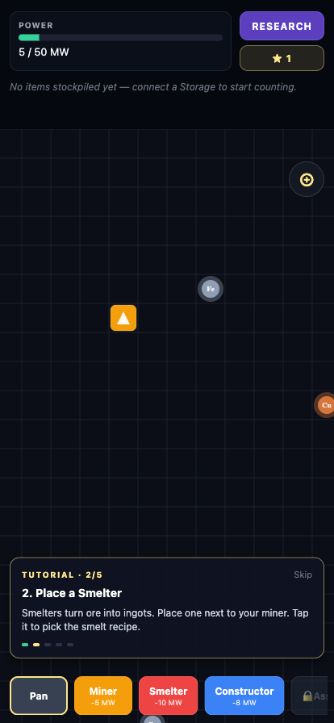
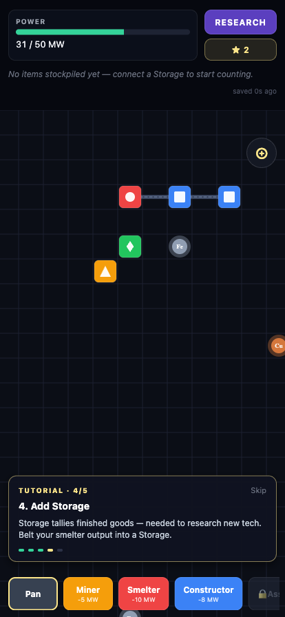
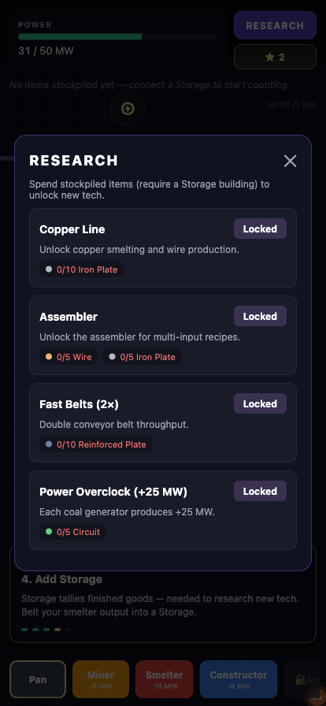
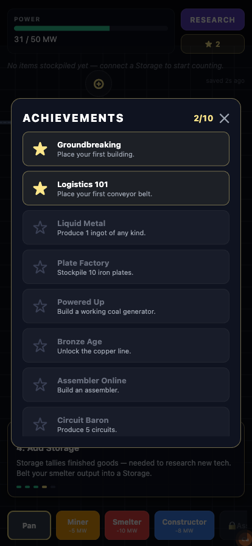

# PocketFactory

A pocket-sized factory simulation, inspired by *Satisfactory* — but redesigned from the ground up for a phone screen. Mine resource nodes, route raw materials through conveyor belts, smelt and assemble finished goods, generate your own power, and research new tech.

<p align="center">
  
</p>

<p align="center">
  <a href="https://kiddkevin00.github.io/pocketfactory/">Marketing site</a> ·
  <a href="https://kiddkevin00.github.io/pocketfactory/support.html">Support</a> ·
  <a href="https://kiddkevin00.github.io/pocketfactory/privacy.html">Privacy</a>
</p>

## Screenshots

<p align="center">
  
  
  
  
</p>

## How to play

1. **Place a Miner** on a glowing resource node (`Fe` iron, `Cu` copper, `C` coal).
2. **Place a Smelter** on an open tile and pick the smelting recipe.
3. **Tap the Belt tool**, then tap a source building followed by a destination — an item flow is created between them.
4. **Add a Storage** at the end of the line. Items reaching storage count toward your stockpile.
5. **Generate power** by mining coal and belting it into a Coal Generator. Every building draws power; if total draw exceeds generation, the factory **browns out**.
6. **Open Research** to spend stockpiled items on unlocks: copper line, assembler, fast belts, power overclock.
7. Pinch to zoom, drag to pan, tap the ⊕ button to recenter on the starting cluster.

## Buildings

| Building | Draw | Notes |
| --- | --- | --- |
| Miner | 5 MW | Place on a resource node. 1 ore / 2s. |
| Smelter | 10 MW | Ore → ingot. 3s/cycle. |
| Constructor | 8 MW | Single-input recipes (plates, rods, wire). |
| Assembler | 15 MW | Two inputs (reinforced plate, circuit). Research-locked. |
| Coal Generator | +75 MW | Burns 1 coal / 4s. |
| Storage | 0 MW | Counts incoming items as stockpile. |

## Stack

- **Expo SDK 56** + TypeScript — runs in Expo Go on iOS / Android, and on web.
- **Zustand** — global game state.
- **react-native-svg** — grid, buildings, belts, items.
- **react-native-gesture-handler** + **react-native-reanimated** — pan / pinch / tap on the canvas.
- **@react-native-async-storage/async-storage** — local save (auto-saves every 10s and on backgrounding).
- Pure-data game engine in `src/game/engine.ts` — deterministic, easy to unit test.

## Running locally

```bash
# Requires Node 22 (pinned via .tool-versions)
npm install
npx expo start
```

Then:
- press `w` for web,
- scan the QR with the **Expo Go** app on your phone, or
- press `i` / `a` for iOS / Android simulators.

## Architecture

```
src/
  game/
    types.ts          # Building, Belt, GameState
    recipes.ts        # Recipe table + item labels/colors
    buildings.ts      # Building specs (power draw, I/O)
    engine.ts         # tick(state, dt) — pure
    achievements.ts   # Goal definitions
    save.ts           # AsyncStorage I/O
  store/
    useGameStore.ts   # Zustand store + tick loop
  ui/
    GameCanvas.tsx    # SVG world + pan/zoom
    HUD.tsx           # Top bar: power, stockpile, buttons
    Toolbar.tsx       # Bottom bar: build tools
    BuildingSheet.tsx # Selected-building inspector
    ResearchModal.tsx
    AchievementsModal.tsx
    Tutorial.tsx
```

## Roadmap

Things explicitly out of scope for v1.0 but interesting for later:

- Building rotation, splitters, mergers
- A bigger world with auto-discovered nodes
- Logistic challenges (item priority, throttling)
- Trains / pipes for liquid transport
- Cloud save sync
- Sound design

## License

MIT
